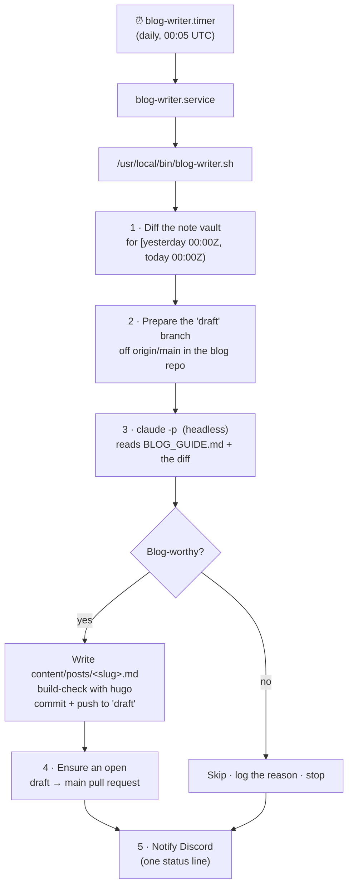

<h1 align="center">blog-agent</h1>

<p align="center">
  <em>A daily autonomous writer that turns your private engineering notes into publishable blog drafts.</em>
</p>

<p align="center">
  
  
  
  
</p>

---

Every night a systemd timer reads **yesterday's** git diff from a private note vault and
asks [Claude Code](https://docs.anthropic.com/en/docs/claude-code), headless, to draft a
public [Hugo](https://gohugo.io) post onto the `draft` branch of your blog — following the
editorial and privacy rules in [`BLOG_GUIDE.md`](./BLOG_GUIDE.md). It opens a
`draft → main` pull request for you to review, and pings Discord with the result.

It **never** touches the blog's `main` branch, and on a thin day — no commits, or nothing
that clears the quality bar — it writes nothing and tells you why.

## Why

Engineers solve interesting problems daily and write almost none of them up: by the time
there's spare energy for a blog post, the specifics have faded. This agent harvests the
detail while it's fresh — straight from the notes you already keep — and hands you a draft
to approve instead of a blank page. You stay the editor; the agent does the first pass.

## How it works



1. **Diff** — collects every change committed to the note vault during yesterday's UTC day.
   On a quiet day (no commits in the window) it skips immediately.
2. **Branch** — checks out a fresh `draft` branch off `origin/main` in the blog repo, so the
   draft never collides with what's already published.
3. **Draft** — Claude Code reads the guide and the diff, judges whether the material clears
   the quality bar, scrubs anything sensitive, then writes one post and verifies it builds
   with `hugo --gc --minify`.
4. **Review** — if a post landed, it opens (or updates) a single `draft → main` pull request
   via the GitHub REST API. You review and merge with one click; the blog's GitHub Pages
   Action publishes only on push to `main`.
5. **Notify** — sends one short status line to a Discord webhook: the verdict plus the post
   slug or the skip reason. No diff content ever leaves the host.

> The PR's personal access token is read from the local git credential store at run time —
> it is never written to disk, committed, or logged.

## Repository layout

| Path | Purpose |
|---|---|
| `blog-writer.sh` | The orchestrator. Installed to `/usr/local/bin/blog-writer.sh`. |
| `backfill.sh` | One-off helper to draft posts across a past date range. |
| `BLOG_GUIDE.md` | Editorial voice, quality bar, frontmatter schema, and privacy/scrub rules. |
| `systemd/blog-writer.{service,timer}` | The schedule. Installed to `/etc/systemd/system/`. |
| `install.sh` | Renders the unit for the current user, deploys, and enables the timer (idempotent). |
| `.env.example` | Config template — copy to `.env` (gitignored) and fill in. |
| `logs/` | Per-run logs. **Local only** (gitignored) — see [Privacy](#privacy). |

## Setup

```bash
git clone https://github.com/suyons/blog-agent.git
cd blog-agent

cp .env.example .env      # edit: paths, GitHub owner, Discord webhook
./install.sh              # deploys the script + unit, enables the timer
```

### Configuration (`.env`)

| Variable | Meaning |
|---|---|
| `DISCORD_WEBHOOK_URL` | Webhook that receives one status message per run. Blank disables notifications. |
| `NOTE_REPO` | Private note vault (a git repo) to read yesterday's diff from. |
| `BLOG_REPO` | Local checkout of the public Hugo blog repo. |
| `AGENT_DIR` | This agent's checkout (where `logs/` and `BLOG_GUIDE.md` live). |
| `GITHUB_OWNER` · `BLOG_REPO_NAME` | Identify the blog repo for opening the `draft → main` PR. |
| `BLOG_WRITER_MODEL` | Model id (default `claude-opus-4-8`; `claude-sonnet-4-6` is cheaper). |

`BLOG_WRITER_DATE=YYYY-MM-DD` (an env var, not stored in `.env`) overrides "today" to
re-run a past day — handy for testing.

## Usage

```bash
# Normal run (what the timer invokes): may commit + push to 'draft'
blog-writer.sh

# Write + hugo build-check only — no commit, no push, no notification
BLOG_WRITER_DATE=2026-06-12 blog-writer.sh --dry-run

# Backfill a date range, one post per active day (edit the range at the top of the file)
./backfill.sh
```

A run that posts reports back like this:

```
blog-writer 2026-06-20: POSTED — foreign-key-restrict-cascade-live-table
```

## Requirements

- A **private note vault** (git) and a **public Hugo blog repo** (PaperMod theme; `main`
  auto-deploys via a GitHub Pages Action), both checked out locally.
- `hugo` (extended) and the `claude` CLI on `PATH`, with Claude authenticated under the
  service user's `$HOME`.
- A **systemd**-based Linux host. The timer runs as your normal user.

## Privacy

The source vault is private and may contain real credentials, IP addresses, hostnames, and
client or employer names. [`BLOG_GUIDE.md`](./BLOG_GUIDE.md) requires the agent to scrub all
of it before anything reaches a public post, and each run's summary lists every redaction it
made and flags any credential that looked real (so you can rotate it).

**Run logs never leave the host.** A log captures the raw note diff and the agent's redaction
summary, so it can contain real secrets — `logs/` is gitignored and is never committed or
pushed. Status is reported only as a short one-line Discord message (verdict + slug or skip
reason), which carries no diff content. Keep your `.env` and your note vault private.
